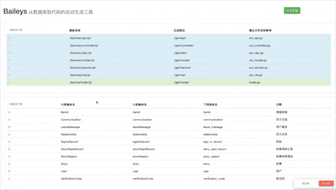

# Baileys —— 从数据库到代码的自动生成工具


[](https://goreportcard.com/report/github.com/LinkinStars/baileys)  

修改配置文件，修改模板，点击生成，从数据库到代码的一键生成完成！  
从此golang的web开发也可以非常简单~   正所谓，只有更快的拧螺丝，才有时间造火箭。



## 使用过程
1. 下载 release 版本，或者 clone 下来你自己编译也可以   
https://github.com/LinkinStars/baileys/releases
2. 解压后，修改 conf 文件夹下的配置文件conf.yml，主要是数据库配置和模板生成路径
3. 修改 tpl 下的模板为你自己想要的样子，你可以先往后走，回来再修改
4. ./baileys 启动
5. 选择你需要的模板和表格，点击生成即可

PS: 修改配置文件，模板，数据库之后，只需要刷新页面即可重新加载，不需要重新启动

下面是默认模板最终生成的样子  
https://github.com/LinkinStars/golang-web-template

## 注释事项
### 命令行参数
-c 可以指定配置文件的目录 默认目录为 "./conf/conf.yml"  
-p 可以指定端口号 默认端口为 "5272"  

### 导入问题
生成文件的位置和 gopath 的设置会影响包的导入

## 模板问题
- 模板文件夹 tpl 中 every 文件夹下的模板表示所有选中数据库的表均会一一去生成，比如一个表生成一个实体类等。  
- one 表示选中的表都会遍历一遍生成一个文件，比如遍历所有的表生成一个路由配置。
- 模板中可以使用的引用字段如下

```go
// TableData 表的数模型
type TableData struct {
    UpperCamelName string // 大驼峰名称
    LowerCamelName string // 小驼峰名称
    UnderlineName  string // 下划线名称
    Comment        string // 注释
    Fields         []FieldData
}

// FieldData 字段的数据模型
type FieldData struct {
    UpperCamelName string // 大驼峰名称
    LowerCamelName string // 小驼峰名称
    UnderlineName  string // 下划线名称
    Type           string // 对应go的类型
    Comment        string // 字段注释
    ORMTag         string // orm框架的标签
    ValTag         string // 验证框架的标签
}
```  

### 命名问题
数据库中字段最好以下划线分割进行命名，这样能最正常的保证输出结果，如果以小驼峰命名可能出现奇怪的命名

### 自定义
主要数据库中拿到的参数这边都已经提供，如果需要可以直接从模板中引用。  
如果参数不够用，比如你需要自定义标签等，那就只能fork过去自己改了。  
如果你有写好的目标想要共享也可以提issue。

## UPDATE
## TODO
- [ ] 更多框架支持
