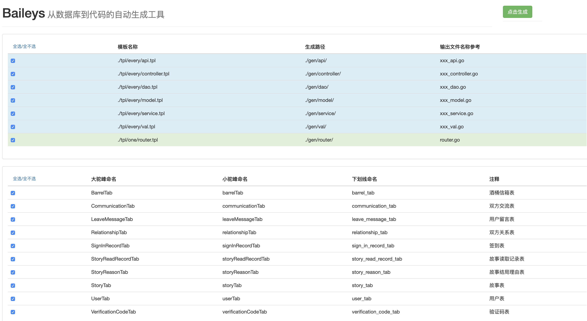

# Baileys —— 从数据库到代码的自动生成工具
只需要简单的修改配置文件，修改生成的模板就能直接从数据库到代码的一键生成  
golang的web开发也可以非常简单~！



目前的默认模板最终生成的样子
https://github.com/LinkinStars/golang-web-template

## 注意事项
- 模板文件夹 tpl 中 every 文件夹下的模板表示所有选中数据库的表均会一一去生成，比如一个表生成一个实体类等。  
- one 表示选中的表都会遍历一遍生成一个文件，比如遍历所有的表生成一个路由配置。
- 模板中可以使用的引用如下

```go
// TableData 表的数模型
type TableData struct {
    UpperCamelName string // 大驼峰名称
    LowerCamelName string // 小驼峰名称
    UnderlineName  string // 下划线名称
    Comment        string // 注释
    Fields         []FieldData
}

// FieldData 字段的数据模型
type FieldData struct {
    UpperCamelName string // 大驼峰名称
    LowerCamelName string // 小驼峰名称
    UnderlineName  string // 下划线名称
    Type           string // 对应go的类型
    Comment        string // 字段注释
    ORMTag         string // orm框架的标签
    ValTag         string // 验证框架的标签
}
```  